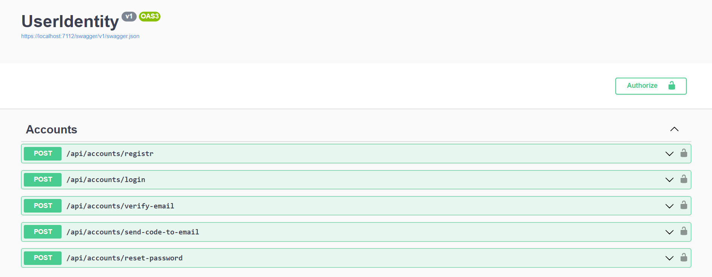
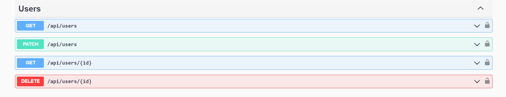

# User Registration 
This repository simplifies user registration in your application, utilizing JWT authentication for security and providing customizable fields. With features like email verification and password encryption, it ensures a seamless and secure registration process. Get started quickly with our easy integration steps.

## Database
This project uses a PostgreSQL database

## Technologies
* [ASP.NET Core 8](https://docs.microsoft.com/en-us/aspnet/core/introduction-to-aspnet-core)
* [Entity Framework Core 8](https://docs.microsoft.com/en-us/ef/core/)
* [Serilog Asp.Net Core](https://github.com/serilog/serilog-aspnetcore)
* [Npgsql Entity Framework Core PostgreSQL](https://github.com/npgsql/efcore.pg)
* [BCrypt.Net-Next](https://github.com/BcryptNet/bcrypt.net)
* [MailKit](http://www.mimekit.net/)
* [Asp.Net Core Authentication Jwt Bearer](https://dotnet.microsoft.com/en-us/apps/aspnet)
* [Microsoft Identity Model Tokens](https://github.com/AzureAD/azure-activedirectory-identitymodel-extensions-for-dotnet)

## Screenshots

